# Schéma de la Base de Données - Système de Gestion de Facturation Eau/Assainissement

## Vue d'ensemble de l'architecture

```mermaid
erDiagram
    %% Entités principales
    UTILISATEURS {
        uuid id PK
        varchar nom
        varchar prenom
        varchar email UK
        varchar hashMotDePasse
        enum role
        enum statut
        varchar telephone UK
        timestamp dateDerniereConnexion
        uuid proprietaireEntrepriseId FK
        varchar tenantId
    }

    ENTREPRISES {
        uuid id PK
        varchar nom
        varchar siret UK
        text adresse
        varchar contactEmail
        varchar contactTelephone
        text adresseSiege
        varchar siteWeb
        varchar typeEntreprise
        varchar tenantId
    }

    CLIENTS {
        uuid id PK
        varchar nom
        varchar prenom
        varchar email UK
        varchar telephone UK
        enum type
        enum statut
        enum statutContractuel
        enum statutPaiement
        enum statutTechnique
        enum statutAbonnement
        enum statutFacturation
        numeric montantImpaye
        uuid proprietaireEntrepriseId FK
        varchar tenantId
    }

    ADRESSES {
        uuid id PK
        uuid utilisateurId FK
        uuid clientId FK
        enum type
        varchar ligne1
        varchar ligne2
        varchar codePostal
        varchar ville
        varchar pays
        boolean isActive
        varchar tenantId
    }

    COMPTEURS {
        uuid id PK
        varchar serial UK
        enum type
        enum statut
        varchar emplacement
        timestamp dateInstallation
        timestamp dateDernierReleve
        numeric valeurDernierReleve
        varchar marque
        varchar modele
        uuid proprietaireId FK
        varchar tenantId
    }

    CONTRATS {
        uuid id PK
        uuid proprietaireId FK
        enum typeProprietaire
        varchar numero UK
        timestamp dateDebut
        timestamp dateFin
        enum statut
        text objet
        numeric montantTotal
        timestamp dateSignature
        timestamp dateResiliation
        text motifResiliation
        varchar statutSignature
        varchar tenantId
    }

    CONTRACT_COSIGNERS {
        uuid id PK
        uuid contratId FK
        uuid cosignataireId FK
        enum typeCosignataire
        enum roleType
        numeric pourcentageParts
        enum statutInvitation
        timestamp dateInvitation
        timestamp dateReponse
        boolean signatureElectronique
        timestamp signatureDate
        varchar emailCosignataire
        varchar telephoneCosignataire
        varchar tenantId
    }

    ABONNEMENTS {
        uuid id PK
        uuid utilisateurId FK
        uuid compteurId FK
        timestamp dateDebut
        timestamp dateFin
        enum frequence
        varchar statut
        timestamp dateResiliation
        text motifResiliation
        numeric montant
        varchar modePaiement
        varchar tenantId
    }

    FACTURES {
        uuid id PK
        varchar numero UK
        timestamp dateEmission
        timestamp dateEcheance
        numeric montantHT
        numeric tauxTVA
        numeric remise
        text mentionsLegales
        text conditionsPaiement
        uuid clientId FK
        varchar statut
        timestamp datePaiement
        varchar modePaiement
        text commentaire
        varchar tenantId
    }

    LIGNE_FACTURES {
        uuid id PK
        uuid factureId FK
        text description
        integer quantite
        varchar unite
        numeric prixUnitaire
        numeric tauxTVA
        varchar statut
        varchar tenantId
    }

    PAIEMENTS {
        uuid id PK
        uuid factureId FK
        numeric montant
        enum methode
        varchar reference
        numeric fraisTransaction
        timestamp datePaiement
        varchar statut
        timestamp dateValidation
        text commentaire
        varchar tenantId
    }

    LETTRAGES {
        uuid id PK
        uuid factureId FK
        uuid paiementId FK
        numeric montantLettre
        timestamp dateLettrage
        varchar tenantId
    }

    INTERVENTIONS {
        uuid id PK
        uuid utilisateurId FK
        uuid compteurId FK
        enum type
        timestamp datePlanifiee
        timestamp dateRealisee
        uuid technicienId FK
        enum statut
        enum priorite
        text description
        text resultat
        numeric cout
        varchar tenantId
    }

    LOTS_FACTURATION {
        uuid id PK
        varchar codeLot UK
        timestamp dateGeneration
        timestamp dateEnvoi
        enum statut
        uuid utilisateurId FK
        text description
        timestamp dateCloture
        varchar tenantId
    }

    TARIFS {
        uuid id PK
        varchar nom
        numeric prixUnitaireM3
        numeric fraisFixes
        varchar zone
        timestamp dateDebutValidite
        timestamp dateFinValidite
        varchar statut
        varchar tenantId
    }

    %% Tables d'audit et historique
    CONTRAT_AUDITS {
        uuid id PK
        uuid contratId FK
        uuid userId FK
        enum action
        json details
        text commentaire
        varchar ipAddress
        text userAgent
        timestamp dateAction
        varchar tenantId
    }

    CONTRAT_COMPTEUR_HISTORIQUES {
        uuid id PK
        uuid contratId FK
        uuid compteurId FK
        uuid interventionId FK
        enum typeAction
        timestamp dateDebut
        timestamp dateFin
        text motif
        text commentaire
        varchar tenantId
    }

    CONTRACT_COUNTERS {
        varchar zone_code PK
        char year_short PK
        integer seq
        varchar tenantId
    }

    %% Tables de gestion des permissions
    PAGES {
        uuid id PK
        varchar key UK
        varchar name
        text description
        varchar tenantId
    }

    ACTIONS {
        uuid id PK
        enum name UK
        text description
        varchar categorie
        varchar tenantId
    }

    PAGE_ACTIONS {
        uuid id PK
        uuid pageId FK
        uuid actionId FK
        varchar tenantId
    }

    ROLE_PAGE_PERMISSIONS {
        uuid id PK
        uuid roleId FK
        uuid pageActionId FK
        boolean allowed
        varchar tenantId
    }

    %% Relations principales
    UTILISATEURS ||--o{ ENTREPRISES : "proprietaire"
    UTILISATEURS ||--o{ ADRESSES : "habite"
    CLIENTS ||--o{ ADRESSES : "habite"
    CLIENTS ||--o{ ENTREPRISES : "proprietaire"
    
    UTILISATEURS ||--o{ COMPTEURS : "proprietaire"
    UTILISATEURS ||--o{ CONTRATS : "proprietaire"
    CLIENTS ||--o{ CONTRATS : "proprietaire"
    
    CONTRATS ||--o{ CONTRACT_COSIGNERS : "cosignataires"
    UTILISATEURS ||--o{ CONTRACT_COSIGNERS : "cosignataire"
    CLIENTS ||--o{ CONTRACT_COSIGNERS : "cosignataire"
    
    UTILISATEURS ||--o{ ABONNEMENTS : "souscrit"
    COMPTEURS ||--o{ ABONNEMENTS : "associe"
    
    CLIENTS ||--o{ FACTURES : "recoit"
    FACTURES ||--o{ LIGNE_FACTURES : "contient"
    FACTURES ||--o{ PAIEMENTS : "recu"
    PAIEMENTS ||--o{ LETTRAGES : "lettre"
    FACTURES ||--o{ LETTRAGES : "lettre"
    
    UTILISATEURS ||--o{ INTERVENTIONS : "demande"
    COMPTEURS ||--o{ INTERVENTIONS : "intervient"
    UTILISATEURS ||--o{ INTERVENTIONS : "technicien"
    
    UTILISATEURS ||--o{ LOTS_FACTURATION : "genere"
    
    CONTRATS ||--o{ CONTRAT_AUDITS : "audite"
    UTILISATEURS ||--o{ CONTRAT_AUDITS : "utilisateur"
    
    CONTRATS ||--o{ CONTRAT_COMPTEUR_HISTORIQUES : "historique"
    COMPTEURS ||--o{ CONTRAT_COMPTEUR_HISTORIQUES : "historique"
    INTERVENTIONS ||--o{ CONTRAT_COMPTEUR_HISTORIQUES : "intervention"
    
    PAGES ||--o{ PAGE_ACTIONS : "actions"
    ACTIONS ||--o{ PAGE_ACTIONS : "pages"
    PAGE_ACTIONS ||--o{ ROLE_PAGE_PERMISSIONS : "permissions"
```

## Analyse des Champs Obligatoires

### Table CONTRATS
**Champs OBLIGATOIRES :**
- `id` (uuid, PK)
- `proprietaireId` (uuid, FK)
- `typeProprietaire` (enum)
- `numero` (varchar, UK)
- `dateDebut` (timestamp)
- `dateCreation` (timestamp)
- `dateMaj` (timestamp)

**Champs OPTIONNELS :**
- `dateFin` (timestamp)
- `statut` (enum, défaut: 'EN_ATTENTE')
- `objet` (text)
- `montantTotal` (numeric)
- `dateSignature` (timestamp)
- `dateResiliation` (timestamp)
- `motifResiliation` (text)
- `statutSignature` (varchar, défaut: 'EN_ATTENTE')
- `tenantId` (varchar)
- `createdBy` (uuid)
- `updatedBy` (uuid)

### Table CONTRACT_COSIGNERS
**Champs OBLIGATOIRES :**
- `id` (uuid, PK)
- `contratId` (uuid, FK)
- `cosignataireId` (uuid, FK)
- `typeCosignataire` (enum)
- `dateInvitation` (timestamp)
- `dateCreation` (timestamp)
- `dateMaj` (timestamp)

**Champs OPTIONNELS :**
- `roleType` (enum, défaut: 'SECONDARY')
- `pourcentageParts` (numeric, défaut: 0)
- `statutInvitation` (enum, défaut: 'ENVOYE')
- `dateReponse` (timestamp)
- `signatureElectronique` (boolean, défaut: false)
- `signatureDate` (timestamp)
- `emailCosignataire` (varchar)
- `telephoneCosignataire` (varchar)
- `tenantId` (varchar)
- `createdBy` (uuid)
- `updatedBy` (uuid)

## Réponse à vos questions

### 1. Les cosignataires sont-ils obligatoires ?

**NON, les cosignataires ne sont pas obligatoires.** 

La table `CONTRACT_COSIGNERS` est une table de liaison qui permet d'associer des cosignataires à un contrat, mais un contrat peut exister sans cosignataire. La relation est :
- Un contrat peut avoir 0, 1 ou plusieurs cosignataires
- Un cosignataire peut être un utilisateur ou un client
- Le champ `roleType` permet de distinguer le propriétaire principal ('PRIMARY') des cosignataires secondaires ('SECONDARY')

### 2. Champs obligatoires vs optionnels

**Pour la création d'un contrat :**

**OBLIGATOIRES :**
- `proprietaireId` : ID du propriétaire (utilisateur ou client)
- `typeProprietaire` : Type du propriétaire (UTILISATEUR, CLIENT, ENTREPRISE)
- `numero` : Numéro unique du contrat
- `dateDebut` : Date de début du contrat

**OPTIONNELS :**
- `dateFin` : Date de fin (contrat à durée indéterminée si null)
- `objet` : Description du contrat
- `montantTotal` : Montant total du contrat
- `statutSignature` : Statut de la signature (défaut: 'EN_ATTENTE')
- `cosignataires` : Liste des cosignataires (optionnel)

**Pour les cosignataires (si ajoutés) :**
- `cosignataireId` : ID du cosignataire
- `typeCosignataire` : Type du cosignataire
- `emailCosignataire` : Email pour l'invitation
- `telephoneCosignataire` : Téléphone pour l'invitation

## Architecture Multi-Tenant

Toutes les tables principales incluent :
- `tenantId` : Identifiant du tenant (organisation)
- `createdBy` : Utilisateur qui a créé l'enregistrement
- `updatedBy` : Utilisateur qui a modifié l'enregistrement
- `dateCreation` : Date de création
- `dateMaj` : Date de dernière modification

Cette architecture permet l'isolation des données entre différents clients/organisations. 