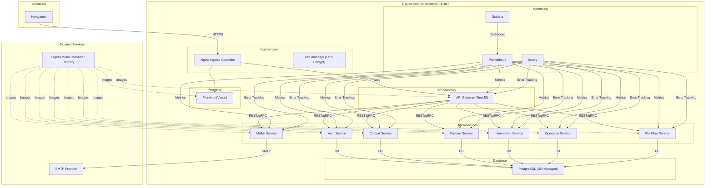

# Architecture AquaERP - Déploiement Cloud

## Vue d'ensemble

AquaERP est une application microservices déployée sur DigitalOcean Kubernetes (DOKS) avec une architecture moderne et scalable.

## Schéma d'architecture

## Composants principaux

### 1. Frontend (Vue.js)
- **Technologie** : Vue.js 3 + TypeScript
- **Déploiement** : Containerisé, servi via Nginx
- **URL** : https://aquaerp.cloud

### 2. API Gateway
- **Technologie** : NestJS
- **Rôle** : Routage, authentification, rate limiting
- **URL** : https://aquaerp.cloud/api/

### 3. Microservices
Chaque service est déployé avec :
- **2 réplicas** pour la haute disponibilité
- **Health checks** (readiness/liveness probes)
- **Variables d'environnement** via Secrets/ConfigMaps
- **Monitoring** Prometheus + Sentry

#### Services disponibles :
- **Auth Service** : Authentification, JWT, gestion utilisateurs
- **Contrat Service** : Gestion des contrats
- **Facture Service** : Génération et gestion des factures
- **Intervention Service** : Planification des interventions
- **Mailer Service** : Envoi d'emails
- **Operation Service** : Gestion des opérations
- **Workflow Service** : Orchestration des processus métier

### 4. Base de données
- **PostgreSQL** managé par DigitalOcean
- **Migrations** : Sequelize
- **Sauvegarde** : Automatique (quotidienne)

### 5. Infrastructure
- **Cluster** : DOKS (3 nœuds)
- **Ingress** : Nginx + cert-manager
- **TLS** : Let's Encrypt automatique
- **Registry** : DigitalOcean Container Registry

## Sécurité

### Niveau Infrastructure
- **Pare-feu** : Ports 22, 80, 443 uniquement
- **TLS** : Certificats automatiques
- **Network Policies** : Isolation des pods

### Niveau Application
- **Authentification** : JWT + 2FA
- **Rate Limiting** : Nginx annotations
- **Secrets** : Kubernetes Secrets
- **Health Checks** : Endpoints protégés

## Monitoring & Observabilité

### Métriques
- **Prometheus** : Collecte des métriques
- **Grafana** : Dashboards et alertes
- **Node Exporter** : Métriques système

### Logs
- **Centralisés** : Via Kubernetes
- **Retention** : 30 jours

### Alertes
- **Email** : Notifications automatiques
- **Slack** : Intégration optionnelle

## CI/CD Pipeline

### GitHub Actions
1. **Build** : Images Docker pour chaque service
2. **Push** : Vers DigitalOcean Container Registry
3. **Deploy** : `kubectl apply -f k8s/`
4. **Health Check** : Vérification des déploiements

### Déclenchement
- **Automatique** : Push sur `main`
- **Manuel** : Via GitHub Actions UI

## Sauvegarde & Récupération

### Stratégie 3-2-1
- **1** : Snapshots PostgreSQL (quotidien)
- **2** : Velero → DigitalOcean Spaces
- **3** : Réplication vers ams3

### Récupération
- **RTO** : < 1 heure
- **RPO** : < 24 heures

## Performance

### Scalabilité
- **Horizontal** : Auto-scaling basé sur CPU/mémoire
- **Vertical** : Ressources ajustables par service

### Optimisations
- **Caching** : Redis (optionnel)
- **CDN** : Pour les assets statiques
- **Compression** : Gzip activé

## Maintenance

### Mises à jour
- **Rolling Updates** : Zéro downtime
- **Rollback** : Via kubectl ou GitHub Actions

### Monitoring
- **Uptime** : 99.9%
- **SLA** : Support 24/7

---

*Document généré automatiquement - Dernière mise à jour : $(date)* 