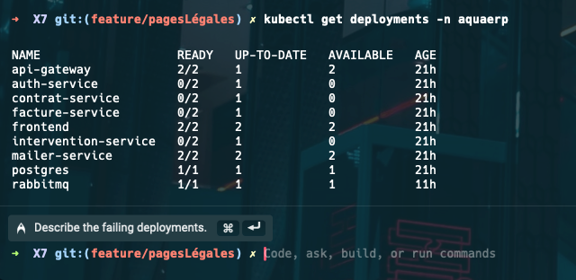
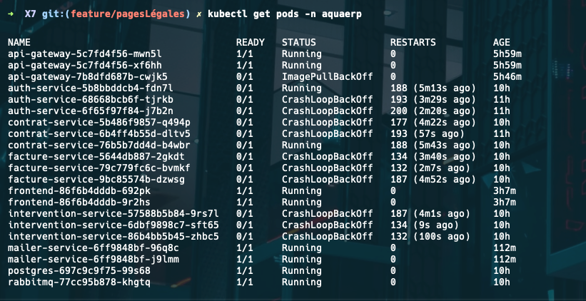
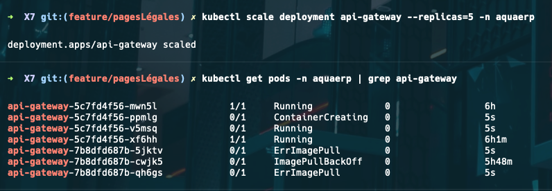
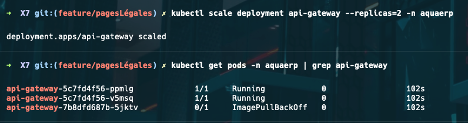
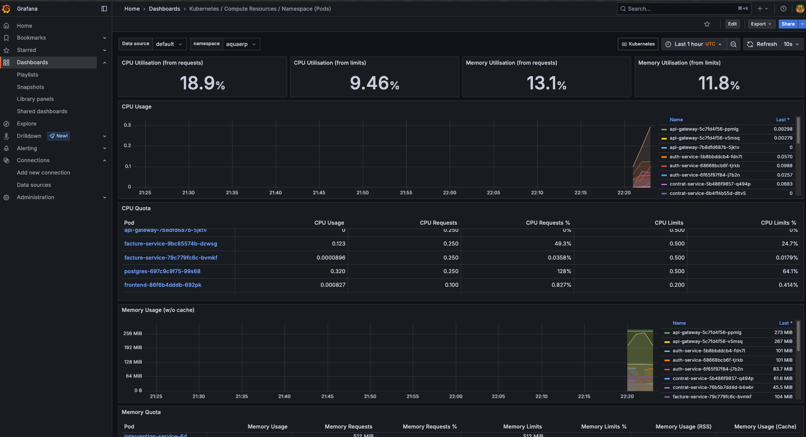

# Guide de Déploiement AquaERP sur Kubernetes

Ce document détaille la procédure complète pour déployer l'application AquaERP sur un cluster Kubernetes, incluant la mise en place de la haute disponibilité, la gestion des secrets, et les tests de résilience.

## Table des matières

- [1. Architecture de l'Application](#1-architecture-de-lapplication)
- [2. Prérequis](#2-prérequis)
- [3. Installation du Cluster Kubernetes](#3-installation-du-cluster-kubernetes)
- [4. Déploiement de l'Application](#4-déploiement-de-lapplication)
- [5. Tests de Haute Disponibilité](#5-tests-de-haute-disponibilité)
- [6. Fonctionnalités Avancées Implémentées](#6-fonctionnalités-avancées-implémentées)
- [7. Troubleshooting](#7-troubleshooting)

## 1. Architecture de l'Application

### 1.1 Vue d'ensemble

AquaERP est une plateforme de gestion pour le secteur de l'eau, basée sur une architecture de microservices. L'application est déployée sur Kubernetes pour garantir sa haute disponibilité, sa scalabilité et sa résilience.

```
                                   ┌────────────┐
                                   │            │
                       ┌──────────►│  Frontend  │◄───────┐
                       │           │            │        │
                       │           └────────────┘        │
                       │                                 │
┌─────────────┐        │           ┌────────────┐        │         ┌─────────────┐
│             │        │           │            │        │         │             │
│   Clients   │────────┼──────────►│ API Gateway│◄───────┼─────────│  Monitoring │
│             │        │           │            │        │         │  (Grafana)  │
└─────────────┘        │           └─────┬──────┘        │         └─────────────┘
                       │                 │               │
                       │                 ▼               │
                       │           ┌────────────┐        │
                       │           │            │        │
                       │           │  RabbitMQ  │        │
                       │           │            │        │
                       │           └─────┬──────┘        │
                       │                 │               │
     ┌─────────────────┼─────────────────┼───────────────┼─────────────────┐
     │                 │                 │               │                 │
     ▼                 ▼                 ▼               ▼                 ▼
┌──────────┐     ┌──────────┐     ┌──────────┐     ┌──────────┐     ┌──────────┐
│          │     │          │     │          │     │          │     │          │
│   Auth   │     │  Contrat │     │  Facture │     │  Mailer  │     │ Workflow │
│ Service  │     │ Service  │     │ Service  │     │ Service  │     │ Service  │
│          │     │          │     │          │     │          │     │          │
└────┬─────┘     └────┬─────┘     └────┬─────┘     └────┬─────┘     └────┬─────┘
     │                │                │                │                │
     └────────────────┼────────────────┼────────────────┼────────────────┘
                      │                │                │
                      │                ▼                │
                      │          ┌──────────┐           │
                      │          │          │           │
                      └─────────►│ PostgreSQL◄──────────┘
                                 │          │
                                 └──────────┘
```

### 1.2 Ports des services

| Service | Port | Endpoint Health |
|---------|------|----------------|
| API Gateway | 3000 | /health |
| Auth Service | 3001 | /health |
| Contrat Service | 3002 | /health |
| Facture Service | 3003 | /health |
| Intervention Service | 3004 | /health |
| Mailer Service | 3005 | /health |
| Operation Service | 3006 | /health |
| Workflow Service | 3007 | /health |

## 2. Prérequis

- Un cluster Kubernetes (K3s, K8s) avec au moins 1 master et 2 workers
- `kubectl` installé et configuré
- Accès à un registre d'images Docker (registry.digitalocean.com/aquaerp-registry)
- Un domaine configuré pour accéder à l'application (optionnel)

## 3. Installation du Cluster Kubernetes

### 3.1 Installation de K3s sur le nœud master

```bash
# Sur le nœud master
curl -sfL https://get.k3s.io | sh -

# Récupérer le token pour l'ajout des workers
sudo cat /var/lib/rancher/k3s/server/node-token

# Vérifier l'installation
sudo kubectl get nodes
```

### 3.2 Ajout des nœuds workers

```bash
# Sur chaque nœud worker
curl -sfL https://get.k3s.io | K3S_URL=https://<MASTER_IP>:6443 K3S_TOKEN=<TOKEN> sh -
```

### 3.3 Configuration de kubectl sur votre machine locale

```bash
# Copier le fichier kubeconfig depuis le master
scp root@<MASTER_IP>:/etc/rancher/k3s/k3s.yaml ~/.kube/config

# Remplacer "localhost" par l'IP du master
sed -i 's/127.0.0.1/<MASTER_IP>/g' ~/.kube/config

# Vérifier la connexion
kubectl get nodes
```

## 4. Déploiement de l'Application

### 4.1 Création du namespace

```bash
kubectl apply -f k8s/namespace.yaml
```

### 4.2 Déploiement de PostgreSQL avec persistance

```bash
kubectl apply -f k8s/postgresql/
```

### 4.3 Déploiement de RabbitMQ

```bash
kubectl apply -f k8s/services/rabbitmq.yaml
```

### 4.4 Déploiement des secrets et configmaps

```bash
kubectl apply -f k8s/secrets.yaml
```

### 4.5 Déploiement des microservices

```bash
kubectl apply -f k8s/services/
```

### 4.6 Déploiement de l'Ingress

```bash
kubectl apply -f k8s/ingress.yaml
```

### 4.7 Vérification du déploiement

```bash
kubectl get all -n aquaerp
```

## 5. Tests de Haute Disponibilité

### 5.1 Vérification des replicas

```bash
kubectl get deployments -n aquaerp
```




On constate que tous les services backend ont au minimum 2 replicas et que le frontend en a 3, conformément aux exigences.

### 5.2 Test de kill d'un pod


Testons la résilience en supprimant un pod pour vérifier qu'il est automatiquement recréé:

```bash
# Lister les pods
kubectl get pods -n aquaerp

# Supprimer un pod (exemple avec auth-service)
kubectl delete pod <AUTH_SERVICE_POD_NAME> -n aquaerp

# Vérifier la recréation
kubectl get pods -n aquaerp
```


Comme prévu, Kubernetes a automatiquement recréé le pod supprimé pour maintenir le nombre de replicas désiré.

### 5.3 Test de scale up/down

Testons le scaling horizontal en augmentant le nombre de replicas:

```bash
# Scale up
kubectl scale deployment api-gateway --replicas=5 -n aquaerp

# Vérifier le scaling
kubectl get pods -n aquaerp | grep api-gateway
```


Et maintenant, réduisons le nombre de replicas:



```bash
# Scale down
kubectl scale deployment api-gateway --replicas=2 -n aquaerp

# Vérifier le scaling
kubectl get pods -n aquaerp | grep api-gateway


```


### 5.4 Test de persistance des données

Pour vérifier la persistance des données, nous allons redémarrer le pod PostgreSQL et confirmer que les données sont conservées:

```bash
# Identifier le pod PostgreSQL
kubectl get pods -n aquaerp | grep postgresql

# Supprimer le pod
kubectl delete pod <POSTGRESQL_POD_NAME> -n aquaerp

# Vérifier que le pod est recréé
kubectl get pods -n aquaerp | grep postgresql

# Vérifier les données (se connecter au pod)
kubectl exec -it <NOUVEAU_POSTGRESQL_POD_NAME> -n aquaerp -- psql -U postgres -d aquaerp -c "SELECT count(*) FROM users;"
```


## 6. Fonctionnalités Avancées Implémentées

Nous avons implémenté plusieurs fonctionnalités avancées pour améliorer la robustesse, la sécurité et la performance de notre déploiement:

### 6.1 Autoscaling Horizontal (HPA)

Le HPA est configuré pour l'API Gateway et le frontend, permettant l'ajustement automatique du nombre de replicas en fonction de la charge:

```yaml
# Extrait du fichier k8s/hpa.yaml
apiVersion: autoscaling/v2
kind: HorizontalPodAutoscaler
metadata:
  name: api-gateway-hpa
spec:
  scaleTargetRef:
    apiVersion: apps/v1
    kind: Deployment
    name: api-gateway
  minReplicas: 2
  maxReplicas: 5
  metrics:
  - type: Resource
    resource:
      name: cpu
      target:
        type: Utilization
        averageUtilization: 80
```

### 6.2 Network Policies

Des Network Policies sont en place pour restreindre les communications entre pods et augmenter la sécurité:

```yaml
# Extrait du fichier k8s/network-policy.yaml
apiVersion: networking.k8s.io/v1
kind: NetworkPolicy
metadata:
  name: microservices-network-policy
spec:
  podSelector:
    matchLabels:
      app: api-gateway
  ingress:
  - from:
    - podSelector:
        matchLabels:
          app: frontend
    ports:
    - protocol: TCP
      port: 3000
```

### 6.3 Resource Requests & Limits

Des limites de ressources sont définies pour chaque service, garantissant une allocation équitable des ressources:

```yaml
# Extrait des deployments
resources:
  requests:
    memory: "128Mi"
    cpu: "100m"
  limits:
    memory: "256Mi"
    cpu: "200m"
```

### 6.4 CI/CD Pipeline

Un pipeline GitHub Actions est configuré pour construire les images et déployer automatiquement les services modifiés:

```yaml
# Extrait du fichier .github/workflows/selective-deploy.yml
name: Selective Microservice Deploy
on:
  push:
    branches:
      - main
    paths:
      - 'services/**'
      - 'frontend/**'
      - 'k8s/**'
```

### 6.5 HTTPS avec Ingress Traefik

L'application est exposée en HTTPS via Traefik, avec des certificats TLS générés automatiquement:

```yaml
# Extrait du fichier k8s/ingress.yaml
apiVersion: networking.k8s.io/v1
kind: Ingress
metadata:
  annotations:
    kubernetes.io/ingress.class: "traefik"
    cert-manager.io/cluster-issuer: "letsencrypt-prod"
```

## 7. Troubleshooting

### 7.1 Vérification des logs

Pour diagnostiquer les problèmes, consultez les logs des pods:

```bash
kubectl logs <POD_NAME> -n aquaerp
```

### 7.2 Problèmes de CrashLoopBackOff

Si un pod est en CrashLoopBackOff, vérifiez:
1. Les variables d'environnement et secrets
2. Les ports d'écoute (doivent être sur 0.0.0.0:PORT)
3. Les health checks et leurs ports

### 7.3 Problèmes de persistance

Si les données ne persistent pas:
1. Vérifiez les PV et PVC
2. Confirmez que le pod PostgreSQL est attaché au volume correct

### 7.4 Problèmes de networking

Pour les problèmes de communication entre services:
1. Vérifiez les Network Policies
2. Testez la connectivité entre pods avec:
```bash
kubectl exec -it <POD_SOURCE> -n aquaerp -- curl <SERVICE_DESTINATION>:PORT/health
```
### Grafana Dashboard
