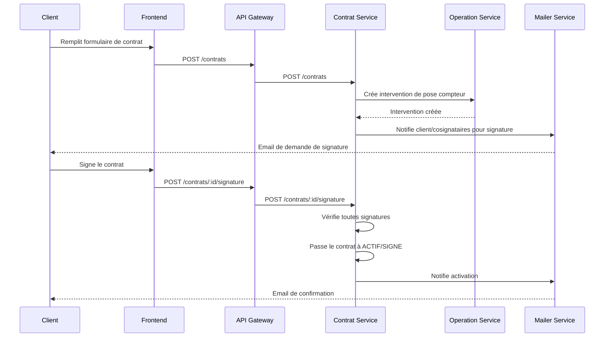
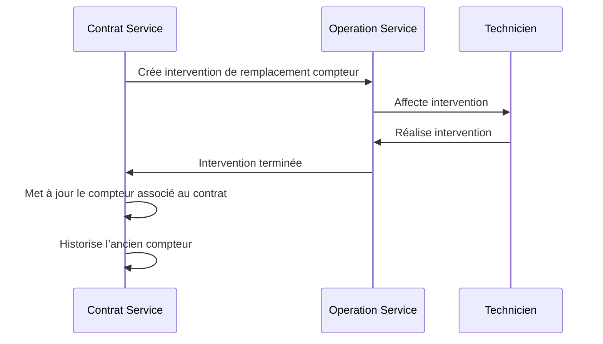

# 📄 Contrat Service – Documentation Métier & Workflow

## Rôle

Gestion du cycle de vie des contrats d’eau/assainissement : création, signature, suspension, résiliation, renouvellement, gestion des cosignataires, association/dissociation de compteurs, interventions métier, liens avec clients/abonnements, audit.

---

## Entités principales

- **Contrat** : Représente l’accord entre le fournisseur et le client (ou entreprise)
- **Cosignataire** : Personne ou entité devant signer le contrat
- **Compteur** : Appareil de mesure associé au contrat (un seul par contrat à un instant T)
- **Abonnement** : Offre ou plan tarifaire lié au contrat
- **Intervention** : Action métier (pose, dépose, relève, remplacement de compteur, etc.)
- **Client** : Titulaire du contrat
- **Historique** : Trace tous les changements majeurs (statut, compteur, signature, etc.)

---

## Cycle de vie d’un contrat

```mermaid
flowchart TD
    C1[Création du contrat] -->|Génère intervention de pose compteur| I1[Intervention: Pose compteur]
    I1 -->|Compteur associé| C2[Contrat ACTIF]
    C2 -->|Signature(s) requise(s)| S1[Signature(s) (client/cosignataires)]
    S1 -->|Toutes signatures OK| C3[Contrat signé]
    C3 -->|Suspension demandée| SUS[Contrat SUSPENDU]
    C3 -->|Résiliation demandée| RES[Contrat RESILIÉ]
    C3 -->|Renouvellement| REN[Renouvellement: nouveau contrat]
    C3 -->|Remplacement compteur| I2[Intervention: Remplacement compteur]
    I2 -->|Nouveau compteur associé| C3
    C3 -->|Dépose compteur| I3[Intervention: Dépose compteur]
    I3 -->|Compteur dissocié| C4[Contrat sans compteur]
```

---
flowchart LR
    D[Demande client] --> E[Vérif éligibilité]
    E --> F[Visite terrain + scan N° série]
    F --> G[Offre & devis]
    G --> H[Invitations cosignataires]
    H --> I{Signatures complètes ?}
    I -- Non --> H
    I -- Oui --> J[Activation contrat]
    J --> K[Publication event contract.created]
    J --> L[Audit & Compteur-Historique]
---

## Logique métier détaillée

### 1. Création d’un contrat
- Création du contrat (statut EN_ATTENTE)
- Génération d’une intervention de pose de compteur si compteur à associer
- Ajout des cosignataires si besoin
- Lien avec le client, l’abonnement, le compteur

### 2. Signature
- Chaque signataire (client, cosignataire) doit signer
- Passage du statutSignature à SIGNE quand tous ont signé
- Date de signature enregistrée

### 3. Suspension
- Changement de statut à SUSPENDU
- Motif et date enregistrés

### 4. Résiliation
- Changement de statut à RESILIE
- Motif et date enregistrés
- Génération d’une intervention de dépose de compteur

### 5. Renouvellement
- Création d’un nouveau contrat (nouvelle période)
- Possibilité de réutiliser le même compteur ou d’en associer un nouveau

### 6. Association/dissociation de compteur
- **Association** :
  - Ajout du compteur au contrat
  - Génération d’une intervention de pose
- **Dissociation** :
  - Suppression du lien compteur-contrat (date de fin)
  - Génération d’une intervention de dépose
  - Historisation de l’ancien compteur

### 7. Interventions métier
- Pose, dépose, relève, remplacement, maintenance, etc.
- Toujours historisées et liées au contrat et au compteur

### 8. Audit & Historique
- Toutes les actions majeures sont historisées (statut, signature, compteur, interventions)
- Possibilité de consulter l’historique d’un contrat

---

## Exemples de flux métier (Mermaid)

### Création et activation d’un contrat


### Remplacement de compteur


---

## Règles métier clés

- Un contrat ne peut avoir qu’un seul compteur principal à un instant T
- Toute opération physique (pose, dépose, remplacement) doit générer une intervention
- La dissociation d’un compteur ne supprime pas l’historique
- Une entreprise peut avoir plusieurs contrats/compteurs (un par site ou usage)
- La cartographie (adresse, GPS) est gérée côté compteur
- L’audit et l’historique sont essentiels pour la traçabilité

---

## Endpoints principaux

- `POST /contrats` : Créer un contrat
- `POST /contrats/:id/signature` : Signer le contrat principal
- `POST /contrats/:id/resiliation` : Résilier le contrat
- `POST /contrats/:id/suspension` : Suspendre le contrat
- `POST /contrats/:id/renouvellement` : Renouveler le contrat
- `POST /contrats/:id/compteurs` : Associer un compteur (génère une intervention de pose)
- `DELETE /contrats/:id/compteurs` : Dissocier le compteur (génère une intervention de dépose)
- `GET /contrats/:id/compteurs/historique` : Historique des compteurs associés
- `POST /contrats/:id/cosignataires` : Ajouter un cosignataire
- `POST /interventions` : Créer une intervention métier

---

## Pour aller plus loin

- Orchestration avec le workflow-service pour les étapes complexes
- Synchronisation avec operation-service pour la gestion des interventions
- Notifications via mailer-service
- Intégration cartographique (compteur/adresse)

---
